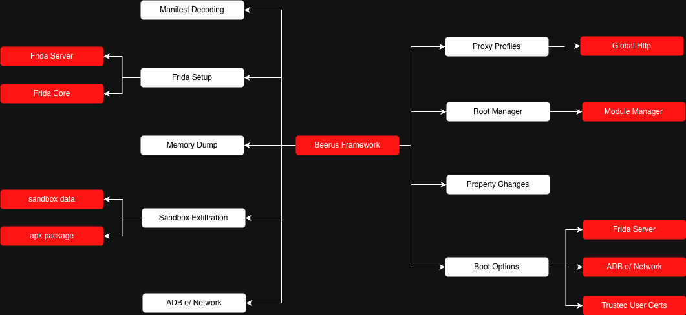
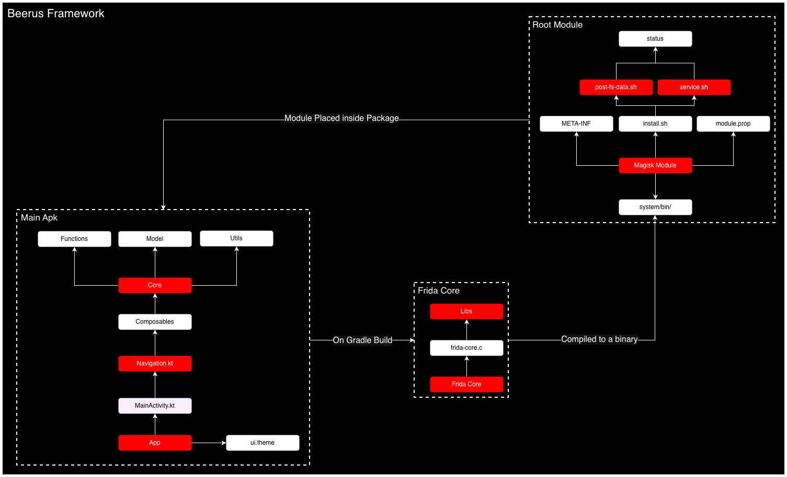

<h1 align="center">Beerus Framework</h1>

  

---

  <strong>Beerus Framework</strong> is a project developed by the <strong>Hakai Offensive Security Research Team</strong> to assist you throughout the mobile penetration testing process. 
  It provides powerful utilities, from sandbox exfiltration PoCs to fully managing and instrumenting applications directly on your device, without needing a computer.

## 📝 Table of Contents

- [About](#about)
- [Build](#build)
- [Getting Started](#getting-started)
- [Built Using](#built-using)
- [Authors](#authors)
- [References](#acknowledgement)

## 🧐 About 

Beerus Framework is a powerful and modular toolkit designed to support every stage of the mobile penetration testing lifecycle. It empowers pentesters with flexibility and efficiency, offering a rich set of features such as:

- **Frida Server** – Simplifies the setup of Frida Server.
- **Frida Core Instrumentation** – Built-in instrumentation directly on the device.
- **Sandbox & APK Exfiltration** – Extract sensitive data and app binaries from protected directories.
- **Memory Dumping** – Capture in-memory secrets and runtime objects.
- **ADB over Network** – Connect to ADB wirelessly, no USB cable required.
- **Global Proxy Profiles** – Enable system-wide proxying for intercepting traffic.
- **Magisk Module Manager** – Manage Magisk modules with ease.
- **Boot Options** – Automatically start Frida Server, ADB, and more on boot.
- **System Certificate Promotion** – Convert user-installed CAs into trusted system certificates for MITM testing.
- **Property Changes** – Modify Android system properties for testing and bypass scenarios.
- **Manifest Decoding** – Quickly extract and analyze key elements from Android application manifests.

  

Learn more in our [Blog Post](https://hakaisecurity.io/beerus-framework-a-new-mobile-framework-arises/insights-blog/).

## 🛠️ Build 

To build the project, you need **Android Studio** with both the **SDK** and **NDK** installed.

During the build process, Gradle compiles one native binary:
- Frida Core

This binary is zipped and included in the APK’s assets along with the Beerus Magisk Module.

  

## 📦 Downloads

The official Beerus Framework builds are available exclusively on [GitHub](https://github.com/hakaioffsec/beerus-android).

Click below to download the latest Beerus APK:

## 🚀 Getting Started 

To get started:

1. Install the APK on your **rooted** device.
2. For full functionality, we recommend [Magisk](https://github.com/topjohnwu/Magisk) to enable features like:
   - Frida Core Instrumentation
   - Magisk Module Management
   - Property Changes
   - Boot Options
3. On first run, Beerus will prompt you to install its Magisk Module.

## ⚙️ Built Using 

- [Frida Core](https://github.com/frida/frida-core) – Instrumentation built-in on device
- [Magisk](https://topjohnwu.github.io/Magisk/guides.html) – For enabling advanced features

## ✍️ Authors 

- [@lur1el](https://github.com/lur1el)
- [@d3vchac](https://github.com/d3vchac)
- [@Tricta](https://github.com/Tricta)
- [@kelvinmontini](https://github.com/kelvinmontini)
- [@ddaniboy](https://github.com/ddaniboy)

## 🎉 References 

- [Frida](https://github.com/frida/frida) – Dynamic instrumentation toolkit for developers, reverse-engineers, and security researchers.
- [Frida Core](https://github.com/frida/frida-core) – Core library for building Frida-based tools and instrumentation.
- [Fridump](https://github.com/Nightbringer21/fridump) – Dump memory and loaded modules from Android apps using Frida.
- [Wireless ADB: ADB over TCP/IP](https://play.google.com/store/apps/details?id=com.origiq.wirelessadb&hl=pt_BR) – Connect to Android devices via Wi-Fi for debugging and testing.
- [Magisk](https://github.com/topjohnwu/Magisk) – Suite of open source tools for customizing Android, enabling root access and more.
- [Always Trust User Certs](https://github.com/NVISOsecurity/AlwaysTrustUserCerts) – Promote user-installed certificates to the system store.
- [Magisk Frida](https://github.com/ViRb3/magisk-frida) – Automatically starts Frida Server on boot using Magisk.
- [JADX](https://github.com/skylot/jadx) – Dex to Java decompiler for Android applications.
- [Metasploit](https://github.com/rapid7/metasploit-framework) – Penetration testing framework for developing and executing exploit code.
